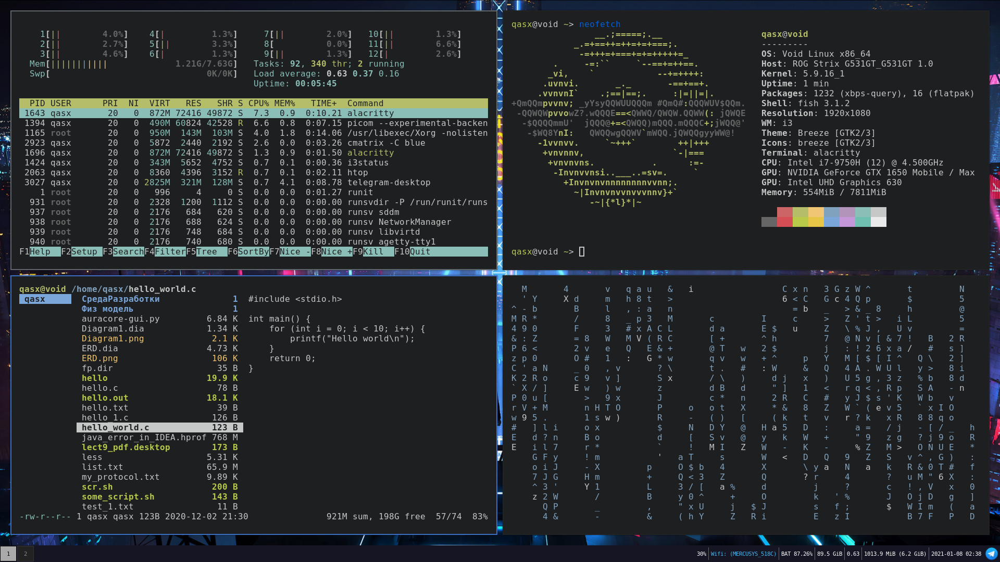

### Hi there 👋

## I'm Junior Software Engineer

- 🔭 I’m currently working on improving my skills.
- 👯 I’m looking to collaborate on any inspiration projects.
- 🤔 I’m looking for help with searching perfect unix-based CLI stuff.
- 📫 How to reach me: dromseproducer@gmail.com
- ⚡ Fun fact: Spending a lot of time watching videos on YT, specially any configuration or customisation of my linux system.

## Experience

## My system configuration
- 💿 Distro: Void Linux
- 🔮 Window Manager: i3wm (i3-gaps)
- 📙 Shell: fish
- 📠 Terminal: Alacritty
- ⌨️ Text-editor: neovim

